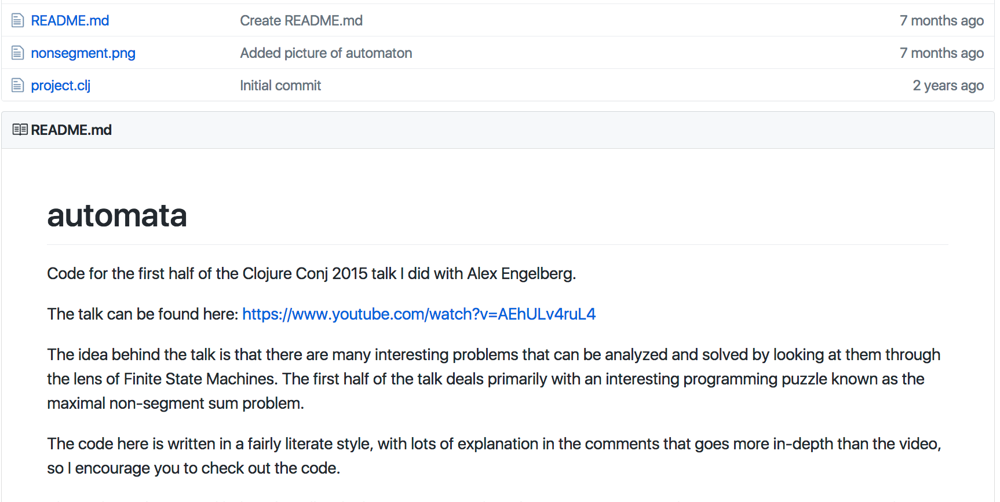
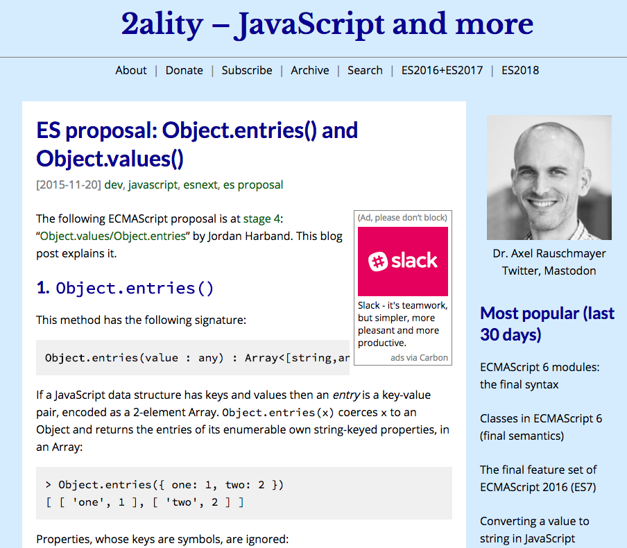
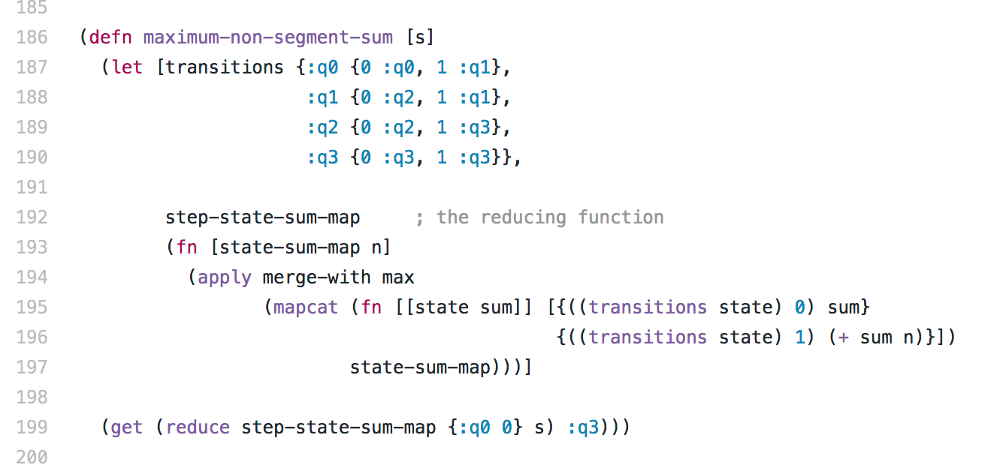
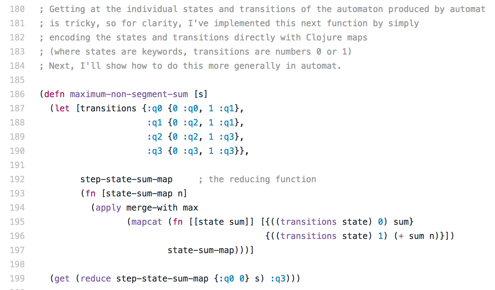
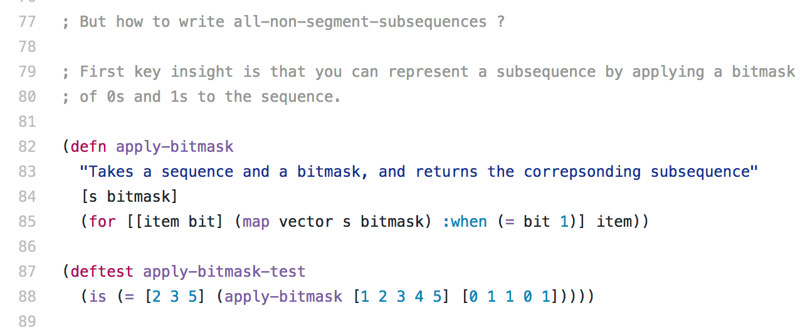
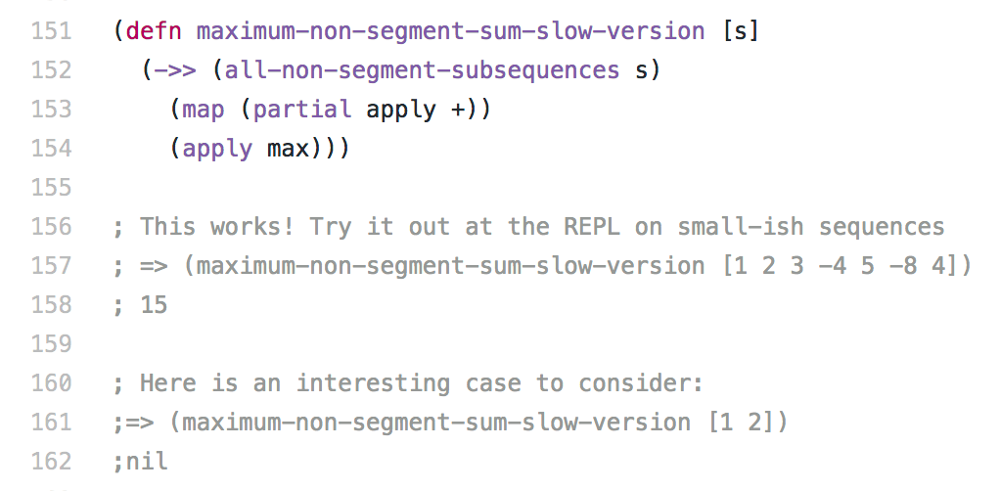
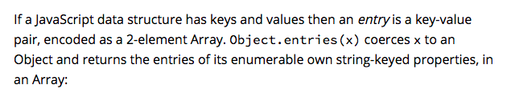
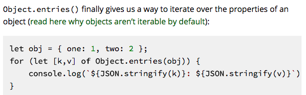
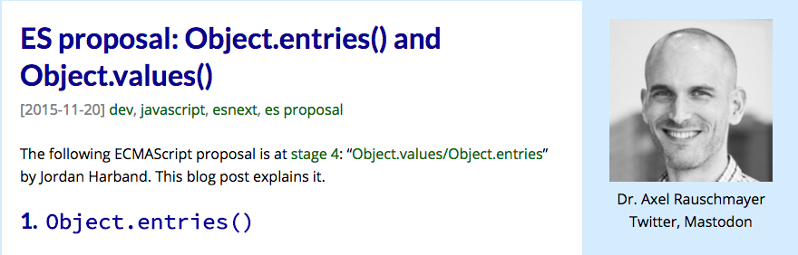

= Illiterate Blogging with Klipse 
:encoding: utf-8
:navigation:
:deckjs_transition: horizontal-slide
:menu:
:status:
:deckjs_theme: none
:hardbreaks:

== Who am I?
[.left]
--
- A mathematician
- A coder
- A pragmatic theorist
- A freak of interactivity
- Founded Audyx in 2013 - an Audiology Startup with 30K LOCs in Clojurescript
- Author of Klipse
++++
                      <a class="github-button" href="https://github.com/viebel/klipse" data-count-href="/viebel/klipse/stargazers" data-count-api="/repos/viebel/klipse#stargazers_count" data-count-aria-label="# stargazers on GitHub" aria-label="Star viebel/klipse on GitHub">KLIPSE</a>
                    
++++
- A Web consultant: Full-Stack, clojure{,script}, ruby{, on rails}, javascript, react
--

image::https://pbs.twimg.com/profile_images/713278171353911296/1a2useM2.jpg[me]

== Agenda

- How programmers traditionnaly tell stories?
- Problems with the traditional approach
- What is Illiterate blogging?
- Examples of Illiterate blogging
- Languages supported by Klipse
- What's in it for you?
- Live blogging session

== Two types of programmers - type 0

[%step]
- Programmers of type 0 love code
- Programmers of type 0 are very smart
- Programmers of type 0 share their ideas in github repos

[%step]
--
.Code for Clojure Conj 2015 talk about using automatas to solve riddles
[caption="Mark Engelberg: ", link="https://github.com/Engelberg/automata"]

--

== Two types of programmers - type 1
[%step]
- Programmers of type 1 love words
- Programmers of type 1 express themselves very well
- Programmers of type 1 share their ideas in blog posts

[%step]
.EcmaScript proposal: Object.entries() and Object.values()
[caption="Dr. Axel Rauschmayer: ", link="http://2ality.com/2015/11/stage3-object-entries.html"]

== Naming

- How would you call programmers of type 0 and 1?
- What type of programmer are you?

== Regular Programmers of type 0
[%step]
How do *regular* programmers of type 0 tell stories?

[%step]
They write *code*.

[%step]

== Good Programmers of type 0
[%step]
How do *good* programmers of type 0 tell stories?

[%step]
They write code and *comments*.

[%step]

== Excellent Programmers of type 0
[%step]
How do *excellent* programmers of type 0 tell stories?

[%step]
They write code, comments and *tests*.

[%step]

== All Programmers of type 0

[%step]
How do *all* programmers of type 0 make their code interactive?

[%step]
They encourage the reader to try it at the REPL
[%step]

== Regular Programmers of type 1

[%step]
How do *regular* programmers of type 1 tell stories?

[%step]
They write their *ideas* in a natural language.
[%step]

== Good Programmers of type 1
[%step]
How do *good* programmers of type 1 tell stories?

[%step]
They write *static code snippets* in a programming language.
[%step]

== Excellent Programmers of type 1
[%step]
How do *excellent* programmers of type 1 tell stories?

[%step]
They add *pictures* to illustrate their ideas.
[%step]

== All Programmers of type 1
[%step]
How do *all* programmers of type 0 make their code interactive?

[%step]
They include the result of the evaluation inside their static code snippets.
[%step]
image::images/es-repl.png[code]

== The problems from the readers perspective

[%step]
--
Problem 0: Readers are not as [.line-through]#smart# familiar with the concepts as the blog author.

They cannot digest complex code just by meditating at it.
They need to interact with it.
--

[%step]
--
Problem 1: Readers are lazy.
Noboding is going to clone your github repo to interact with the code you have linked to in your blog post.
--

[%step]
--
[.line-through]#Problem# Fact 2: Readers are kids.
They love to play.
--

== The solution

[custom-quote]#Illiterate blogging with https://github.com/viebel/klipse[Klipse]#

[%step]
--
*Literate Programming*: Embedding of natural language sentences in a program.

*Illiterate Blogging*: Embedding of interactive code snippets in a blog post.
--

== Klipse demo

- http://blog.klipse.tech/clojure/2016/09/30/automata-segments-1.html[Interactive version of solving riddles with automata]
- http://blog.klipse.tech/javascript/2016/12/19/es2017-entries.html[Interactive version of ES proposal: Object.entries() and Object.values()]
- http://exupero.org/hazard/post/fractals/[An interactive blog post about fractals] by https://twitter.com/exupero[@exupero].

== Klipse: How does it work?

[%step]
--
The klipse plugin is a javascript tag that transforms static code snippets of an html page into live and interactive snippets:

- *Live*: The code is executed in your browser
- *Interactive*: The reader can modify the code and it is evaluated as she types

The code evaluation is done in the browser: no server is involved at all!
--

[%step]
--

- The code snippets are put in dom elements with a class of your choice.
- Code snippets of different languages must have different classes.
- The classes are passed to the `klipse_settings` object.
- You can configure the settings of each Klipse snippet by setting `data-` attributes.

More details in https://github.com/viebel/klipse[Klipse README].
--

[%step]

https://jsfiddle.net/viebel/50oLnykk/[A minimal example of a html page with Klipse].

== Klipse: Main features

[%step]
- code is evaluated as you type (configurable)
- supports many languages: clojure, javascript (es7, jsx, react), ruby, python, brainfuck, scheme...
- clojurescript transpilation
- environment is shared between code snippets
- hidden code snippets
- snippet preamble	
- pretty printing
- code evaluation in a loop
- load code from a github gist
- interacting with the DOM
- the CodeMirror editor is configurable: options and CSS

== Klipse: code is evaluated as you type

Zero-delay between the trial and the result is key for *creativity*.

++++
  
++++
video::PUv66718DII[youtube,640,480, start=218]
++++
  
++++

[%step]
--
[source.eval-js]
----
[1,2,3].map(x => x + 1)
----
--

[%step]
--
++++
<pre><code class="eval-js" data-async-code="true">
$("#container-1")
.css({color: 'white',
       backgroundColor: 'blue',
      padding: '10px',
      fontSize: '50px'})
.text("Hello World")
</code></pre>
++++
++++

++++
--

== Klipse: environment is shared between Klipse snippets

A blog post is a story.

The different elements of the stories need to be connected together.

[%step]
--
Let's see how to write a *Hello World* function in Clojure:

[source.clj]
----
(defn hello [name]
  (str "hello " name "\n"))
----
--
[%step]
--
And now, let's see how to use this function:
[source.clj]
----
(hello "Klipse")
----
--
[%step]
--

☕You can embed a `jsfiddle` or a `codepen` in a blog post with an `<iframe>`.
But you cannot share neither the code nor the data between the iframes.
--

== Hiding some details from the reader

[%step]
--
> Less is more

You don't want to confuse your readers with technical details that are not revelant to the main idea of your article.

But you need this (irrelevant) code to let the other parts of the code run properly.
--

[%step]
--
Two mechanisms for hiding code from the reader but not from Klipse:

- A hidden Klipse snippet
- `data-preamble`
--

[%step]
--
You can hide a snippet using CSS
[.text]
----
<pre class="hidden"><code class="clj">
(def irrelevant-constant
42)
</code></pre>
----
++++
<pre class="hidden"><code class="clj">
(def irrelevant-constant  42)
</code></pre>

There is a hidden Klipse snippet just above me

++++

We can use the hidden code in subsequent Klipse snippets:
[source.clj]
----
irrelevant-constant
----
--

[%step]
--
We can hide part of the Klipse snippet's code using `data-preamble`.
[.text]
----
<pre><code class="clj" data-preamble="(def random-num  (rand))">
random-num
</code></pre>
----
--

[%step]
--
++++
<pre><code class="clj" data-preamble="(def random-num (rand))">
random-num
</code></pre>
++++
--

== Warning

Are you ready for a journey into the wonderland of programming languages?

++++
              

		</img>
	      

++++

image::images/journey.jpg[journey,900]

== Klipse: javascript
[%step]
--
Demonstrate EcmaScript 2017 features before they are available in the browser

[source.es2017]
----
const cond = true;
const obj = {
  ...(cond ? {a: 1} : {}),
  b: 2,
};
obj
----
ES2017 code is transpiled by https://github.com/babel/babel-standalone[babel-standalone].
--

[%step]
--
`console.log` is redirected to the result box

[source.eval-js]
----
console.log("Hello World!")
3 + 4
----
--

[%step]
--
Let's escape the callback hell!
`async` and `await` in action
++++
<pre><code class="eval-js" data-async-code="true">
async function sleep(ms = 0) {
  return new Promise(r => setTimeout(r, ms));
}

async function run() {
  console.log("Before: " + (new Date()).toString());
  await sleep(1000);
  console.log("After:  " + (new Date()).toString());
}

run();
</code></pre>
++++
--

== Klipse: javascript with DOM

[%step]
--
Klipse is 100% client side.
You can interact with the page that contains the Klipse snippets.
--

[%step]
--
[source.eval-js]
----
$('#container-1345')
  .css({color: 'white',
        backgroundColor: 'green',
        padding: '10px',
        fontSize: '50px'})
  .text("Hello World")
1
----

++++

++++

--

[%step]
--
Each Klipse snippet is bound to a container accessible through `window.klipse_container` with id `window.klipse_container_id`.
[source.eval-js]
----
$(klipse_container)
  .css({color: 'white',
        backgroundColor: 'blue',
        padding: '10px',
        fontSize: '50px'})
  .text("I am the container bound to the Klipse snippet just above me")
1
----
--

== Klipse: react.js and JSX

[%step]
--
JSX is a language for writing `react` components almost in HTML 
--

[%step]
--
It is transpiled into plain javascript
[source.transpile-jsx]
----
const element = <h1>Hello, world!</h1>;
----
--

[%step]
--
We can mix static and dynamic pieces of code
[source.render-jsx]
----

Hello, world -- 14*3={14*3}!

----
--

[%step]
--
Let's leverage the functional power of javascript
[source.render-jsx]
----

  {[1,2,3].map(i => 
               
Hello, world -- 14*{i}={14*i}!

              )}

----
--

[%step]
--
JSX code is transpiled by https://github.com/babel/babel-standalone[babel-standalone].

Learn more about JSX in this http://blog.klipse.tech/javascript/2016/12/14/jsx.html[interactive JSX tutorial].
--

== Klipse: Ruby

[%step]
--
Simple stuff
[source.ruby]
----
[1,2]*10
----
--

[%step]
--
Let's have some real fun!!!
How would you call this piece of ruby code?
[source.ruby]
----
->(f){
  f[f]
  }[->(func){
    ->(n) { n == 0 ? 1 : n * func[func][n-1]}
    }][19]
----
--
[%step]
--
The evaluation of ruby code in the browser is powered by http://opalrb.org/[Opal].
--

== Klipse: Scheme

[%step]
--
Scheme
[source.scheme]
----
(let ((a 1)
      (b 2))
  (cdr (list a b a b)))
----
--

[%step]
--
Let's enjoy a bit of code from https://mitpress.mit.edu/sicp/full-text/book/book.html[SICP]: Recursion vs. Iteration.
--

[%step]
--
Factorial implemented with recursion

[source.scheme]
----
(define (factorial-rec n)
  (if (= n 1)
      1
      (* n (factorial-rec (- n 1)))))

(factorial-rec 50000)
----

No stack overflow because BiwaScheme is https://github.com/biwascheme/biwascheme/issues/95[smart].
--

[%step]
--
Factorial implemented with iteration (a.k.a tail-call recursion)

[source.scheme]
----
(define (factorial-iter n)
  (fact-iter-inner 1 1 n))

(define (fact-iter-inner product counter max-count)
  (if (> counter max-count)
      product
      (fact-iter-inner (* counter product)
                 (+ counter 1)
                 max-count)))

(factorial-iter 5)
----
--

[%step]
--
Learn more about scheme in this http://blog.klipse.tech/scheme/2016/09/11/scheme-tutorial-1.html[Interactive overview of Scheme's semantics].
The evaluation of scheme code in the browser is powered by http://www.biwascheme.org/[BiwaScheme].
--

== Klipse: Scheme - fun with car and cdr

Who wants to share a fun piece of code with `car` and `cdr`?

== Klipse: Brainfuck

[%step]
--
Brainfuck is an esoteric language with only 8 characters.

It helps to understand what is a Turing machine
--

[%step]
--
[source.brainfuck]
----
+++++++++++++++++++++++++++++++++ Increment 33 times
.
+++++++++                         Increment 9 times
.
>>                                Move forward twice
----
--

[%step]
--
Addition of two numbers
[source.brainfuck]
----
+++++++    put 7 on cell #0
>          move to cell #1
+++        put 3 on cell # 1
<          move to cell #0
[->+<]     dec cell #0 and inc cell #1 until cell #0 is 0
>          move to cell #1
.          output cell #1
----
--

[%step]
--
Hello World
[source.brainfuck]
----
++++++++++[>+++++++>++++++++++>+++>+<<<<-]>++.>+.+++++++..+++.>++.<<+++++++++++++++.>.+++.------.--------.>+.>
----
--
[%step]
--
Eval
[source.brainfuck]
----
[in: ++++++++++[>+++++++>++++++++++>+++>+<<<<-]>++.>+.+++++++..+++.>++.<<+++++++++++++++.>.+++.------.--------.>+.>.!]

>>>>+[->>>++>+>+++++++[<++++>>++<-]++>>+>+>+++++[>++>++++++<<-]+>>>,<++[[>[->>]<[>>]<<-]<[<]<+>>[>]>[<+>-[[<+>-]>]<[[[-]<]++<-[<+++++++++>[<->-]>>]>>]]<<]>[-]+<<[--[[-]>>-<<<+>]>>[-<<<<[>+<-]+<<+[->[<+>>>>>>+<<<<<-]<[>+<-]>>>>>>>+<[-[-[-[-[-[-[-[-[[-]>-<]>[-<<+++++++>>]<]]]>[-]<]>[-<<+++>>]<]>[-<<+>>]<]>[-]<]>[-<<<<<<<+>>>>>>>]<]>[-]<<<<<]>>>[<<+>>-]<+<[-[-[-[-[-[-[-[-[-[-[[-]>-<<<[-]<<+>>]]]]>[-]<]>[-<<<[-]<<+++++++>>>]<]]]>[-]<]>[-<<<[-]<<+++++++>>>]<]]>[-]<<<<<<[-]>>[-<<<[>+>>+<<<-]>[<+>-]>>[-[-[[-]>>]>[<<[<+>>+<-]>[<+>-]+<<-[-[-[-[-[-[-[-[-[-[-<+>]<+++++++++++++>>[-]>->-<<]]]>>[->>>>>]<<]>>[-<<<++++++++++++>>[-]>>-]<<]>>[->>>>>]<<]>>[-<<<+++++++++++>>[-]>>-]<<]>>[-<<<++++++++++>>[-]>>-]<<]]>>[->>>>>]<<]<]]>[>>]<<<]>>+>>>]<<]>>[->+>]<<<]<<[<<]>>[[<+>>+<-]+<-[-[-[-[-[-[-[-[-[-[-[-[-[-[-[->->>[>>]>>[>>]<[<-<<-<]<[<<]<<[<<]<]>[->>[>>]>>[>>]<[>+>>+>]<[<<]<<[<<]]<]>[->>[>>]>>[>>]<[-]<[<<]<<[<<]]<]>[->>[>>]>>[>>]<[<-<]<[<<]<<[<<]]<]>[->>[>>]>>[>>]<[>+>]<[<<]<<[<<]]<]>[->>[>>]>>[>>]<<-<<-<<[<<]<<[<<]]<]>[->>[>>]>>[>>]+>>+[<<]<<[<<]]<]>[->>[>>]>>[>>]<++<[<<]<<[<<]]<]>[->>[>>]>>[>>]<+<[<<]<<[<<]]<]>[->>[>>]>>[>>]<,<[<<]<<[<<]]<]>[->>[>>]>>[>>]<-<[<<]<<[<<]]<]>[->>[>>]>>[>>]<.<[<<]<<[<<]]<]>[->>[>>]>>[>>]<<-<<[<<]<<[<<]]<]>[->>[>>]>>[>>]+[<<]<<[<<]]<]>[->>[>>]>>[>>]<[>+>>+<<<-]>[<+>-]>>[<<+>>[-]]+<<[>>-<<-]>>[<<+>>>>+<<-]>>[<<+>>-]<<[>>+<<-]+>>[<<->>-]<<<<[-<<[<<]<<[<<]<<<<<++>>]>>[-<<<<<<[<<]<<[<<]<]>]<]>[->>[>>]>>[>>]<[>+>>+<<<-]>[[<+>-]>>[-]+<<]>>[<<+>>>>+<<-]>>[<<+>>-]<<[>>+<<-]+>>[<<->>-]<<<<[-<<[<<]<<[<<]<<<<<+>>]>>[-<<<<<<[<<]<<[<<]<]>]>[<+>-]<<<<<<[>>+<<-[->>->>+[>>>[-<+>>+<]+<-[-[[-]>-<]>[-<<<+>>>]<]>[-<<<->>>]>[-<+>]<<<<[>>+<<-]>>]<<<<<<]>>[-<<+[>>>[-<+>>+<]+<-[-[[-]>-<]>[-<<<->>>]<]>[-<<<+>>>]>[-<+>]<<<<[<<+>>-]<<]]]>>>>>>>]
----
--

== Klipse: Lua (implemented in WebAssembly)

[%step]
--
[source.lua]
----
function hello(s)
  print("Hello " .. s)
end

print("Hello " .. "World!")
----

The evaluation of lua code in the browser is powered by https://github.com/vvanders/wasm_lua[wasm_lua].
--

== Klipse: Python

[%step]
--

Python
[source.python]
----
print([x + 1 for x in range(10)])
----
--

[%step]
--

Python Turtle
[source.python]
----
import turtle

t = turtle.Turtle()

for i in range(4):
	t.forward(150)
	t.left(90) 
----
--

[%step]
--
You can even http://blog.klipse.tech/python/2017/01/04/python-turtle-fractal.html[draw fractals] with the python turtle.

The evaluation of python code in the browser is powered by https://github.com/skulpt/skulpt[Skulpt].
--

== Klipse: The integration

All the details are in https://github.com/viebel/klipse[Klipse README]

== Survey

[%step]

- How many people are bloggers?
- How many people have a github repository?
- Are you a programmer of type 0 or type 1?
- How many people read blogs?

== What's in it for you?

[%step]
--
- Ask from bloggers to _klipsify_ their articles
- Give a star to https://github.com/viebel/klipse[Klipse on Github]
++++
                      <a class="github-button" href="https://github.com/viebel/klipse" data-count-href="/viebel/klipse/stargazers" data-count-api="/repos/viebel/klipse#stargazers_count" data-count-aria-label="# stargazers on GitHub" aria-label="Star viebel/klipse on GitHub">KLIPSE</a>
                    

++++

- Share the world about code interactivty with your friends
- Write an interactive blog post: It's the best way to learn a topic and it's really fun!
- Klipsify a tutorial, a scientific paper, a blog post...
- Klipsify your library documentation 
--

== Questions

image::images/questions.jpg[questions]

== Enough words

Let's write our first illiterate blog post together

include::klipse.adoc[]
++++

++++
