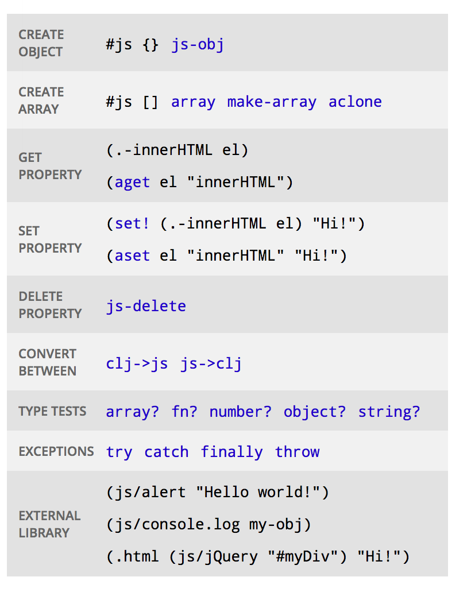

= React on steroids with ClojureScript
:encoding: utf-8
:navigation:
:deckjs_transition: horizontal-slide
:menu:
:status:
:deckjs_theme: none
:hardbreaks:

++++
<pre class="hidden"><code class="clj">
(ns my.m$macros)
(require '[reagent.core :as r])
(require '[reagent.ratom :as ratom])

</code></pre>
++++

== React on steroids with ClojureScript

++++
<section class="slide">
        

            

              

	      </img>
	      

              

		

                  

                    
                  
 
                  

		  
React Next

		  
Tel Aviv - Sep 10, 2017

                  

                  

                    

                      <a class="github-button" href="https://github.com/viebel/klipse" data-count-href="/viebel/klipse/stargazers" data-count-api="/repos/viebel/klipse#stargazers_count" data-count-aria-label="# stargazers on GitHub" aria-label="Star viebel/klipse on GitHub">KLIPSE</a>
                    

                    
                  

                  

		  <a href="https://tinyurl.com/recljs"> https://tinyurl.com/recljs </a>
                  

		

              

            

            

	       
	      

	      
Hiccup

		<pre><code class="reagent" data-loop-msec="1000" data-beautify-strings="true">
		[:h3 (str (js/Date.))]
		</code></pre>
		 
		
 JSX 

		<pre><code class="render-jsx" data-loop-msec="1000" data-beautify-strings="true">
&lt;h3&gt;{(new Date()).toString()}&lt;/h3&gt;
		</code></pre>
	      

            

	      
	    
Yehonathan Sharvit

	    
 <a href="https://twitter.com/viebel">@viebel</a>, viebel@gmail.com

        

      </section>
++++

== Agenda

- ClojureScript: a pragmatic LISP transpiled into javascript
- Hiccup: HTML as data
- Reagent: an elegant ClojureScript interface to React
- Going further

== Who am I?
[.left]
--
- Yehonathan Sharvit https://twitter.com/viebel[@viebel], viebel@gmail.com, https://www.linkedin.com/in/viebel/[LinkedIn]
- A mathematician
- A coder
- A pragmatic theorist
- A freak of interactivity
- Founded Audyx in 2013 - an Audiology Startup with 30K LOCs in Clojurescript
- Author of https://github.com/viebel/klipse[Klipse] - a simple client-side code evaluator pluggable on any web page 
++++
                      <a class="github-button" href="https://github.com/viebel/klipse" data-count-href="/viebel/klipse/stargazers" data-count-api="/repos/viebel/klipse#stargazers_count" data-count-aria-label="# stargazers on GitHub" aria-label="Star viebel/klipse on GitHub">KLIPSE</a>
                    
++++
- A Web consultant: Full-Stack, clojure, clojurescript, javascript, node.js, react
- Blogger about functional programming at http://blog.klipse.tech/[blog.klipse.tech]
--

image::https://pbs.twimg.com/profile_images/713278171353911296/1a2useM2.jpg[me]

== ClojureScript - historical perspective

* 1930: Alonzo Church discovers the  https://en.wikipedia.org/wiki/Lambda_calculus[λ-calculus] - the mathematical foundation for functional programming
* 1958: John McCarthy invents https://en.wikipedia.org/wiki/Lisp_(programming_language)[LISP] - the first Functional Programming language
* 1995: Brendan Eich is recruited by Netscape to do "scheme (a LISP dialect) in the browser"
* Eventually, he invents Javascript
* 2007 - Rich Hickey invents Clojure - A *pragmatic* dialect of LISP on top of the JVM
* 2011 - ClojureScript - Clojure transpiled to javascript because "Clojure rocks, Javascript reaches!"
* 2013 - Facebook creates react.js - A functional javascript frontend framework
* Dec 2013 - First release of reagent - A react cljs interface that is faster than react!

== Clojure: a dialect of LISP

LISP is homoiconic: the syntax of the code is the same as the syntax of the data - lists.
LISP stands for LIst Processor.

[%step]
--
Code is expressed as lists where:

- the first element of the list is the function
- rest of the list are the arguments to the function

[source.clj]
(+ 1 2 3 40)
--

[%step]
--
Unlike in javascript, every piece of LISP code is an expression (including `if`, `for` etc...).
[source.clj]
----
(for [i [1 2 3 4]]
  (if (odd? i)
    i
    (* i 10)))
----
--

== Clojure - functions

[%step]
--
Function definition:

[source, role="clj"]
----
(defn hello [name]
  (str "Hello " name "!"))
----
--

[%step]
--
Function application:

[source, role="clj"]
----
(hello "React Next")
----
--

== Interactivity

You can follow this presentation on your desktop, tablet, phone...
All the code snippets are interactive!

++++
              

		</img>
		<a style="font-size:3em;" href="https://tinyurl.com/recljs"> https://tinyurl.com/recljs </a>
	      

++++

image::images/journey.jpg[journey,900]

== Clojure - Immutable data structures

[%step]
--
Data structures are immutable.
You cannot change an object.
You can only compute a new version of the object.
--

[%step]
--
[source.clj]
----
(def a {:hello "React"})
(assoc a :hello "Reagent")
----

[source.clj]
----
a
----
--

[%step]
--
The cool thing is that in Clojure, Immutable data structures are performant.
Read http://hypirion.com/musings/understanding-persistent-vector-pt-1[here] if you want to understand this magic.
--

== Immutability - why is it so good

[%step]
--
Simpler to reason.
Kills lots of bugs before they arise.
--

[%step]
--
Great performance in react-like apps (`shouldComponentUpdate`).
With immutable data, comparing two data structures is done via pointer comparison (recursively).
In many cases, ClojureScript react apps are faster than javascript react apps.
--

== Clojure - atoms and mutations

[%step]
--
Mutations are achieved with a specific mechanism called `atom`.
The atom itself is not mutable but the "content" of the atom is mutable.
In order to get the "content" of an atom, you have to `deref` it.
--

[%step]
--
[source.clj]
----
(def a-atom (atom {:hello "React"}))
@a-atom
----
--

[%step]
--
Two ways to change the content of an atom: `reset!` and `swap!`:

[source.clj]
----
(reset! a-atom {:hello "Reagent"})
----
--

[%step]
--
[source.clj]
----
(swap! a-atom assoc :chalom "Next")
----
--

[%step]
--
We can add a watcher to an atom:
[source.clj]
----
(add-watch a-atom :watcher
  (fn [key atom old-state new-state]
    (prn "-- Atom Changed --")
    (prn "key" key)
    (prn "atom" atom)
    (prn "old-state" old-state) 
    (prn "new-state" new-state)))
----
--

[%step]
--
Let's `swap!` again:
[source.clj]
----
(swap! a-atom assoc :bonjour "Tomorrow")
----
--

== Macros - the language itself is extensible

This is one of the most powerful feature of LISP languages.

[%step]
--
[source.clj]
----
(defmacro deflog [name args body]
  `(defn ~name ~args (println (str "LOG: "'~name " was called")) ~@body))
----
--

[%step]
--
Let's see it in action:
[source.clj]
----
(my.m/deflog hello-me [name]
  (str "hello " name))

(hello-me "React Next")
----

--
[%step]
Macros work particularly well in LISP because code is data (homoiconicity).
Therefore, manipulating code is usually a matter of list manipulation.
--
--
[%step]
--
Let's see it how the macro has been expanded:
[source.clj]
----
(macroexpand-1 '(my.m/deflog hello-me [name]
  (str "hello " name))) 
----
--

[%step]
--
- In fact, many terms of the language are just macros that a developer could have written: `for`, `when`, `->` ...
- If javascript had a macro system, it would have been much simpler to create JSX (or maybe a better solution)
--

== HICCUP - HTML as data

[%step]
--
Representing HTML in Clojure Data Structures:

- vectors to represent elements
- maps to represent an element's attributes
--

[%step]
--
[source.reagent]
----
[:div "Hello World"]
----
--

[%step]
--
[source.reagent]
----
[:p
 "Hello "
 [:a {:href "https://en.wikipedia.org/wiki/World"} "World"]
 "."]
----
--

[%step]
--
What about styles?
[source.reagent]
----
[:p 
 "Hello " 
 [:span {:style {:color "red"}} "World"]
 "."]
----
--

[%step]
--
Hiccup also supports shorthands for classes, ids and also element squeezing with `>`:
[source.reagent]
----
[:div#foo-12.supercool "My Div"]
----
[source.reagent]
----
[:div>p>s "Nested Element"]
----
--

== HICCUP vs JSX - runtime components

[%step]
--
++++
<h3>JSX</h3>
++++
In JSX, when you want to chose the component at runtime,

you have to assign a capitalized variable

--
[%step]
--
[source.eval-jsx]
----
function HelloLang({name}){
  const components = {
    "javascript": "div",
    "clojurescript": "p"
  }
  const Component = components[name] || "s";
  return <Component> {name} </Component>;
}
----

[source.render-jsx]
----

  <HelloLang name={'javascript'}/>
  <HelloLang name={'clojurescript'}/>
  <HelloLang name={'rubyscript'}/>

 
----
--

[%step]
--
++++
<h3>Hiccup</h3>
++++
In Hiccup, you are free!
[source.reagent]
----
(defn hello-lang [name] ;; doesn't have to be capitalized!!!
  (let [components {"javascript" "div"
                    "clojurescript" "p"}]
    [(components name "s") name]))

[:div
 [hello-lang "javascript"]
 [hello-lang "clojurescript"]
 [hello-lang "scalascript"]]
----
--

== HICCUP vs JSX - if and for 

[%step]
--
++++
<h3>JSX</h3>
++++
In JSX, you cannot use `if` and `for`.

The reason: `if` and `for` are not expressions in javascript

--
[%step]
--
[source.render-jsx]
----
<ul>
  {[...Array(5).keys()].map(i => i % 2 === 0 && <li> {i} </li>)}
</ul>
----
--

[%step]
--
++++
<h3>Hiccup</h3>
++++
In Hiccup, you are free!
 
[source.reagent]
----
[:ul
 (for [i (range 5)]
  (if (even? i)
    [:li i]))]
----
--

== HICCUP vs JSX - comments

Have you ever tried to comment out part of your JSX form?
In Hiccup, you can comment out any part of the expression.

[%step]
--
No comments.
--

[%step]
--
[source.reagent]
----
[:div
 [:strong "Hello "]
 ;[:em "World"]
 #_[:p [:em "This is "]
     [:strong "not so funny"]]]
----
--

== HICCUP vs JSX: Summary

[%step]
--
Hiccup forms are plain Clojure vectors:

- you don't need to learn the Hiccup syntax
- you don't need to write a preprocessor
- you don't need to write IDE plugins
- there are no edge cases
- you can test part of your components as plain clojure functions
- you can parse your hiccup code
--

[%step]
--
[source.reagent]
----
(def a "hello")
[:h3 a " world"]
----
--

[%step]
--
is translated by Klipse into:

[source.clj]
----
(def a "hello")
(r/render-component [:h3 a " world"] js/klipse-container)
;
----
--

== Reagent - basic components

[%step]
Pure components are created with clojure functions

[%step]
--
[source.clj]
----
 (defn button [text]
  [:button
   {:on-click
    (fn [e]
      (js/alert "You pressed the button!"))}
   text])
----
--
[%step]   
--
We embed a component, like we embed html tags using the function name instead of a keyword:

[source.reagent]
----
[:div
 [:div "This is a button"]
 [button "Click me"]]
----
--

== Reagent - ratom and state

Ratom (reagent atom) has the same interface as a clojure atom: `reset!`, `swap!` and `@`.
Any component that dereferences a ratom will be automatically re-rendered.

[%step]
--
[source.clj]
----
(def counter (r/atom 0))
(defn button-inc [text]
  [:button
   {:on-click
    (fn [e]
      (swap! counter inc))}
   text])
(defn counter-display [] 
  [:h3 "cnt: " @counter])
----
--

[%step]
--
[source.reagent]
----
[:div
 [counter-display]
 [button-inc "Click me"]]
----
--

== Reagent - local ratom

[%step]
--
If we want the ratom to be local to the component,

we have to instantiate the `ratom` inside the component

and return a function instead of a hiccup form

[source.clj]
----
(defn button-and-counter [text val]
  (let [counter (r/atom val)]
    (fn [text]
      [:div
       [:div "Counter: " @counter]
       [:button
        {:on-click
         (fn [e]
           (swap! counter inc))}
        text]]))) 
----
--

[%step]   
--
[source.reagent]
----
[:div
 [button-and-counter "Click here" 42]
 [button-and-counter "Click also here" 64]]
----
--

[%step]
--
The rationale is:

- The outer function is called once *per component instance*.
- The inner function is called once *per rendering*.

More details about reagent components https://github.com/Day8/re-frame/wiki/Creating-Reagent-Components[here].
--

== Reagent - reactions

[%step]
--
Reactions allow you to define a ratom as an expression of other ratoms.

Let's say we have a growing list of numbers and we want 3 components presenting the same list:

- in its original order
- sorted
- reversly sorted

--

[%step]
--
Let's create a `ratom` and a `reaction`:

[source.clj]
----
(def numbers (r/atom (repeatedly 5 (partial rand-int 100))))
(def sorted-numbers (reagent.ratom/reaction (sort @numbers))) 
----
--

[%step]
--
And now let's display the three components
[source.reagent]
----
(defn sorted-d20 []
  [:div
   [:button {:on-click (fn [e] (swap! numbers conj (rand-int 20)))} "Roll!"]
   [:p (str @numbers)]
    [:p (str @sorted-numbers)]
    [:p (str (reverse @sorted-numbers))]])  
----
--

[%step]
--
How does this magic happen?
How could the reaction be re-calculated when the atom's value changes?
--

[%step]
--

*Macros!*

[source.clj]
----
(defmacro reaction [& body]
  `(reagent.ratom/make-reaction
    (fn [] ~@body)))
----
--

== Reagent - fully configurable components

Sometimes, you need to get access to the React lifecycle methods: `componentWillMount`, `shouldComponentUpdate` etc...

Read https://github.com/Day8/re-frame/wiki/Creating-Reagent-Components#form-3-a-class-with-life-cycle-methods[Form-3 Reagent components] to learn how to do that.

== Reagent - cool stuff

[%step]   
--
Let's draw a small logo in SVG:
[source.reagent]
----
(defn logo []
  (let [blue "#5881d8"
        green "#63b132"]
    [:svg {:style
           {:width "150px"}}
     [:circle {:r 50, :cx 75, :cy 75, :fill blue}]
     [:circle {:r 25, :cx 75, :cy 75, :fill green}]
     [:path {:stroke-width 12
             :stroke "white"
             :fill "none"
             :d "M 30,40 C 100,40 50,110 120,110"}]]))

----
--

[%step]   
--
Now, let's duplicate them:
[source.reagent]
----
[:span (repeat 5 [logo])]
----
--

== Reagent - cool stuff (cont.)

Let's arrange the logos in a circle...

[%step]
--
[source.clj]
----
(defn circle-of [num comp]
  (into
    [:svg {:style {:border "1px solid"
                   :background "white"
                   :width "500px"
                   :height "500px"}}]
    (for [i (range num)]
      [:g
       {:transform (str
                     "translate(250,250) "
                     "rotate(" (* i (/ 360 num)) ") "
                     "translate(100)")}
       [comp]])))
----

[source.reagent]
----
[:div
 [circle-of 12 logo]
 ;[circle-of 10 (fn [] [:circle {:r 50, :cx 75, :cy 75, :fill "blue"}])]
]
----
--

== Appendix - ClojureScript Javsacript Interop

== Going further

- ClojureScript advanced compilation (Google Closure Compiler) and https://clojurescript.org/guides/externs#externs-inference[Externs inference]
- https://clojurescript.org/news/2017-07-12-clojurescript-is-not-an-island-integrating-node-modules[ClojureScript integration with npm]
- http://timothypratley.blogspot.co.il/2017/01/reagent-deep-dive-part-1.html[Reagent deep dive].
- https://github.com/Day8/re-frame[re-frame]: A Reagent Framework For Writing SPAs, in Clojurescript.
- https://github.com/omcljs/om/wiki/Quick-Start-%28om.next%29[om.next]: A  uniform yet extensible approach to building networked interactive applications, in Clojurescript.
- https://github.com/reagent-project/reagent-cookbook/tree/master/recipes/reagent-server-rendering[Reagent server rendering]
- http://ramdajs.com/[Ramda.js]: A practical functional library for JavaScript programmers (inspired by Clojure).
- https://facebook.github.io/immutable-js/[Immutable.js]: Immutable collections for JavaScript (inspired by Clojure).
- http://redux.js.org/[Redux] - inspired by clojurescript and om
- https://www.sweetjs.org/[sweet.js] - bringing macros into the javascript world
- http://blog.klipse.tech/javascript/2016/12/14/jsx.html[JSX interactive tutorial] powered by Klipse.

== ClojureScript: Learning tools

- http://clojurians.net/[Clojurians]: The Clojure and ClojureScript Slack
- http://clojurescriptkoans.com/[ClojureScript koans]: the path of enlightenment to learning ClojureScript
- https://clojuredocs.org/[ClojureDocs]: community-powered documentation and examples repository for Clojure
- http://app.klipse.tech/[Klipse]: a ClojureScript Web REPL
- http://blog.klipse.tech/[blog.klipse.tech]: Articles about Clojure and ClojureScript

== Questions

image::images/questions.jpg[questions]

++++
<h3>Meanwhile, you can give a github star to <a href="https://github.com/viebel/klipse">Klipse</a>... </h3>
++++

include::klipse.adoc[]